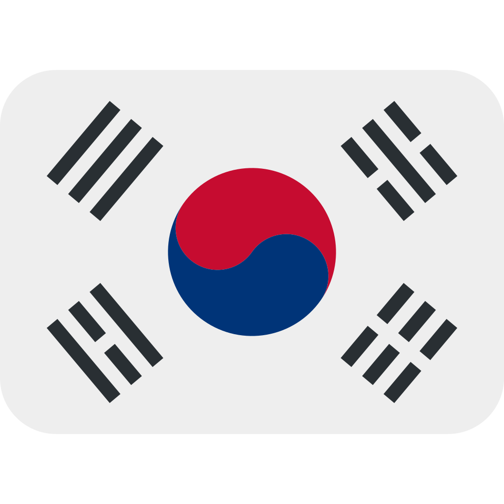
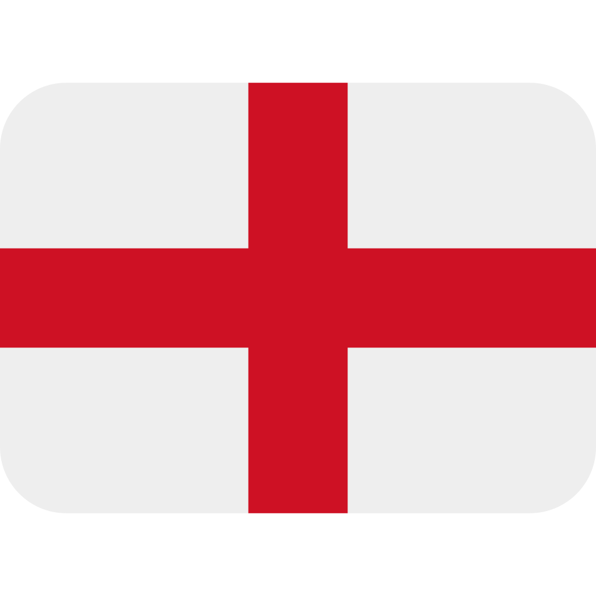
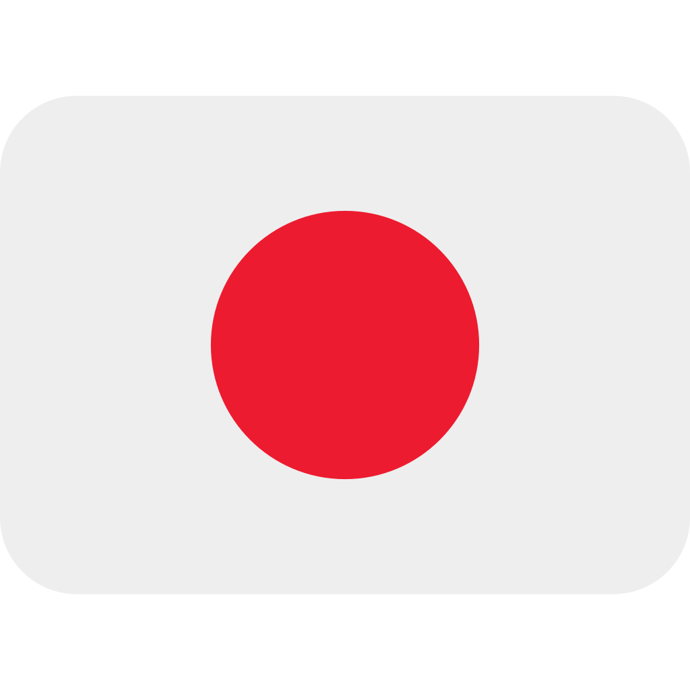
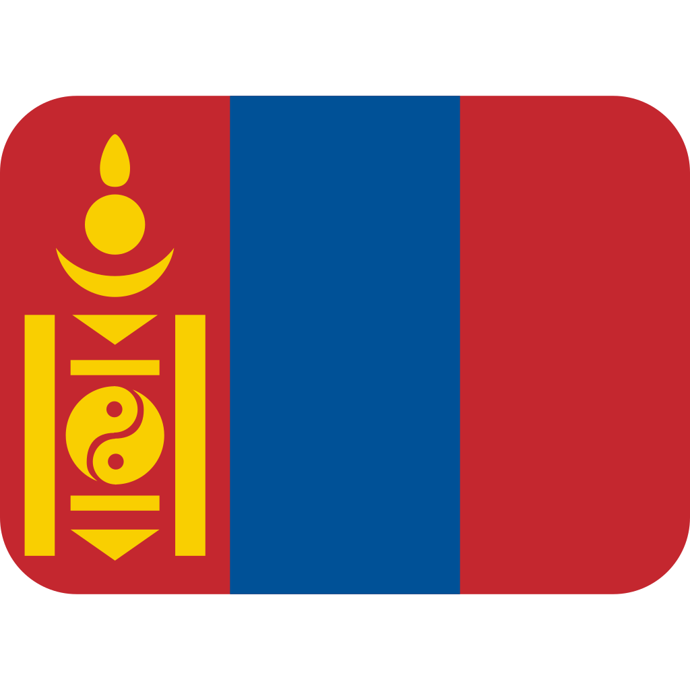

## Hi there 👋

**I'm Jongmin** - I'm a frontend developer, designer, and college student. What I'm interested in is artificial intelligence(AI), being a fullstack developer, and WEB and APP development. I usually work on my club projects and my own projects.

### My Programming Skills

### My Natural Languages

