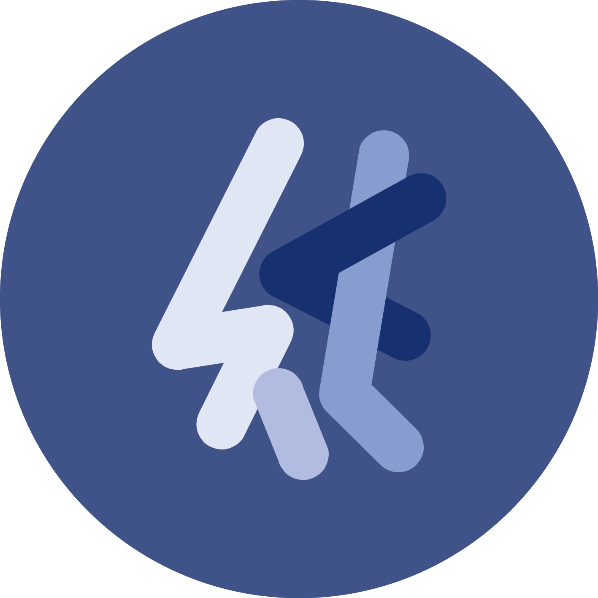

  

## ❔ Simply introducing
> I'm the one of enjoying coding:)

### 🌱 What I currently learning

  
  
  
  
   
  
  
  
   
  

    
### 🔭 What I interested in

  
  

<!--
**chunzhi23/chunzhi23** is a ✨ _special_ ✨ repository because its `README.md` (this file) appears on your GitHub profile.

Here are some ideas to get you started:

- 🔭 I’m currently working on ...
- 🌱 I’m currently learning ...
- 👯 I’m looking to collaborate on ...
- 🤔 I’m looking for help with ...
- 💬 Ask me about ...
- 📫 How to reach me: ...
- 😄 Pronouns: ...
- ⚡ Fun fact: ...
-->
